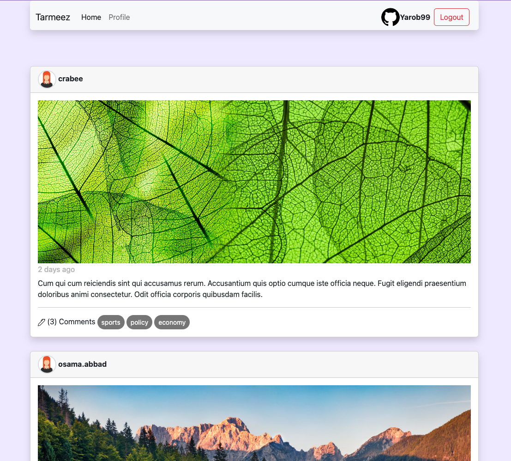

# **موقع تواصل اجتماعي (html - css - js - bootstrap)**

<b>
مشروع تعليمي تم إنشاؤه كجزء من سلسلة جافاسكريبت في أكاديمية ترميز على اليوتيوب، و هو المشروع النهائي في السلسلة و الذي تم فيه تطبيق المفاهيم الخاصة بالسلسلة و معرفة كيفية تطبيقها على مشروع كبير نسبيا كهذا المشروع.
رابط السلسلة في قناة أكاديمية ترميز
</b>

**[(سلسلة جافاسكريبت المستوى المتقدم)](https://www.youtube.com/watch?v=i190vlA7gE0&t=6067s&ab_channel=%D8%A3%D9%83%D8%A7%D8%AF%D9%8A%D9%85%D9%8A%D8%A9%D8%AA%D8%B1%D9%85%D9%8A%D8%B2)** 

**في قناة**

**[(أكاديمية ترميز على اليوتيوب)](https://www.youtube.com/@user-py5qp1ez4y)** 
